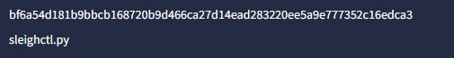
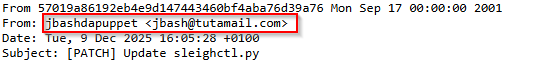
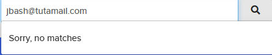
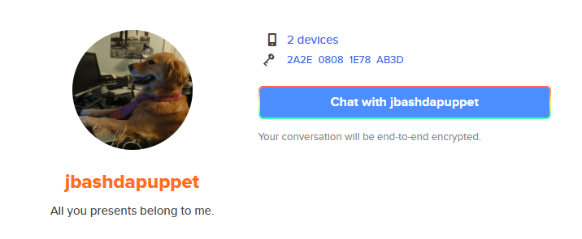
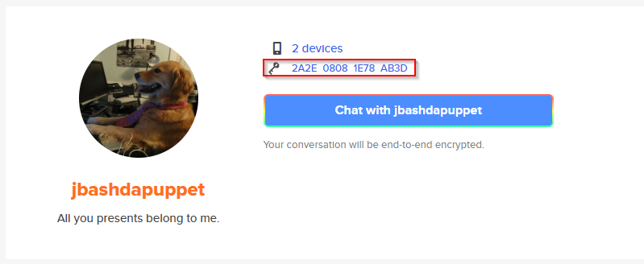
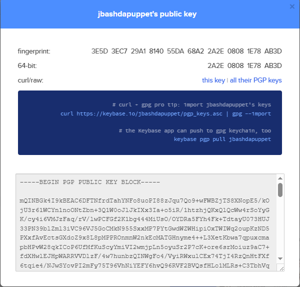

# Santa Root Kit


## Contexte
> Oh no, it looks like the Grinch’s assistant pwned us !
> Luckily, our experts managed to recover two key informations:
> - A file hash: ```bf6a54d181b9bbcb168720b9d466ca27d14ead283220ee5a9e777352c16edca3```
> - A leaked message that said more intels can be found somewhere in a vault.
>
> Our team keeps digging but we wouldn’t mind a bit of help..
> Will you please help us finding intel on them ?


## Step 1
We are provided with a hash, let’s head to VirusTotal and see if we manage to find some infos in order to start our investigation.<br>
Uploading our hash, we can see it was already analyzed before, probably the Grinch’s assistant doing some early test.<br></br>
At first glance, we barely have anything interesting, except for the file’s name:


## Step 2
What if they never renamed that file ? Let’s check the usual platforms.<br></br>
Github got a hit, there’s a very suspicious looking dog who seems to have pushed a few commits that could match our case, and the repository’s name itself is suspicious as well:<br></br>
<br></br>
<br></br>
**Looking at that repository, we might be on the right track** 👀
<br></br>
So, going through the repository and it’s commits, there are a couple things that catch our attention.
- First of all, we found an email address by checking the patch files associated to the commits (simply append .patch at the end of the url)<br></br>
<br></br>

[Example with commit 57019a86192eb4e9d147443460bf4aba76d39a76](https://github.com/jbashdapuppet/santa-root-kit/commit/57019a86192eb4e9d147443460bf4aba76d39a76.patch)
- We also found an interesting #TODO in the sleighctl.py file:<br>
```#TODO: Optimize the code / Add comments / Replace our PGP key on "that website"..```

It doesn’t seem like there is much more to get from that GitHub tho..
The email is too recent, so it doesn’t give results either.

## Step 3
**What about that PGP key ?**<br>
PGP keys are used in quite a few ways.
Let’s see what the web says about PGP in an Osint context.

A quick search suggests this [article](https://nixintel.info/osint-tools/using-pgp-keys-for-osint/) from Nixintel:

- The first and second tools showcased are interesting but won’t be of much help since we don’t have any key so far.
- But the third one is about [Keybase](https://keybase.io/) , a PGP oriented social media.

Searching for the email address we found isn’t useful:<br>


But what if we went for the nickname instead ?<br>
<br>
The first result seems to be a legitimate user but the second one rings a bell, it uses the same profile picture that was used by the Github account.<br></br>

<br>
Bingo ! Their bio is also the same sentence that was in the Github repository’s readme file.

Going around the profile, we can see some activity, a few registered devices etc.
They also added a PGP fingerprint to their profile.

Keybase lets you download a user’s PGP keys, so let’s give that a try:



Let’s grab the key and see if we can get some infos out of it.

By running a simple ```gpg <file>``` command, we can see the dummy has added way too many infos in the comment, leaving a Proton Drive URL:


## Step 4
Accessing that URL leads us to the following Vault:<br>


It seems like it does indeed contain the “new key” and some other materials that should definitely not be in there:


And apparently, they even managed to fail the sharing process, they added a link to the wrong folder, providing access to the Santa's naughty secrets folder.

And here is our flag :shipit:


```FLAG: RM{H0_H0_H0_1_M16H7_83_1N_7r0U813}```
